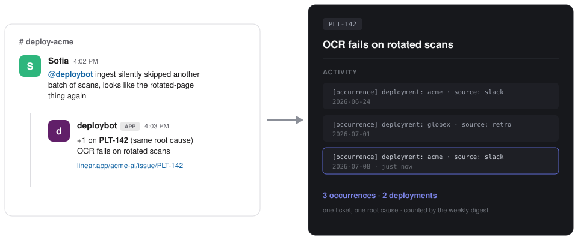
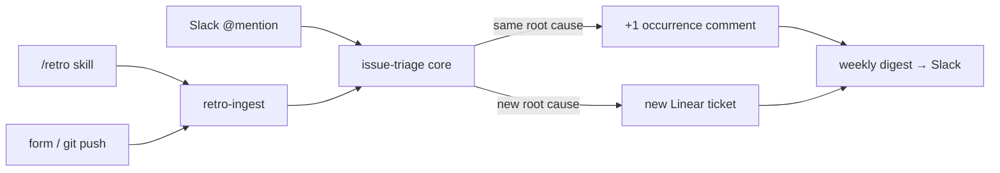

# deploykit

An open-source kit for agent-native **deployment engineering**. Designed to be forked and adapted to deployment workflows in your organization. 


[](LICENSE)

<!-- TODO: replace with a real screenshot/GIF after the n8n import smoke test -->


Reported multiple times across multiple channels, filed once. Deduplication happens at the **root-cause level** (an LLM judges "would fixing that ticket fix this report?"), not by string matching. And every Monday at 9am, the platform team's channel gets the counts:

```
🔁 Top recurring deployment issues - week of 2026-07-06

1. PLT-142 OCR fails on rotated scans - 3× this week (acme, globex)
2. PLT-158 Ingest skips oversized batches - 2× this week (acme)
```

That `3× (acme, globex)` is three separate reports about the same root cause, from two customers, rolled onto one ticket.

## What's in the kit

| Artifact | What it does | Format |
|---|---|---|
| [`workflows/slack-linear-triage`](workflows/slack-linear-triage) | @mention a bot → thread is sanitized and triaged into Linear | n8n workflow |
| [`workflows/retro-ingest`](workflows/retro-ingest) | Retro in (form, webhook, or git push) → every issue triaged into Linear | n8n workflow |
| [`workflows/_shared/issue-triage`](workflows/_shared/issue-triage) | The core both inlets call: extract → sanitize → dedup → +1 or create | n8n sub-workflow |
| [`workflows/occurrence-digest`](workflows/occurrence-digest) | Weekly top-recurring-issues digest → Slack | n8n workflow |
| [`protocols/DEPLOY.md`](protocols/DEPLOY.md) | Deployment-debt protocol: verify first, log every workaround with sanitized context | Markdown template |
| [`protocols/RETRO.md`](protocols/RETRO.md) | Daily deployment retro: what worked today, debt verdicts, machine-ingestable issues | Markdown template |
| [`checklists/pre-deployment.md`](checklists/pre-deployment.md) | Before you arrive / day one / before you leave | Markdown checklist |
| [`skills/deploy-protocol`](skills/deploy-protocol) | Claude Code / Cursor enforce the DEPLOY.md protocol while you hack on-site | Agent skill + rules |
| [`skills/retro`](skills/retro) | `/retro` runs the daily deployment retro (interview or paste of meeting notes), writes the file, submits it to the funnel | Claude Code skill |

Ships against Slack + Linear + OpenAI on n8n. Every integration point is a single node swap (Anthropic, Ollama, reaction-triggers, other trackers).

## Quickstart: pick your door

**The feedback funnel (~20 min).** Import [`issue-triage`](workflows/_shared/issue-triage) (the core), then [`slack-linear-triage`](workflows/slack-linear-triage), [`retro-ingest`](workflows/retro-ingest), and [`occurrence-digest`](workflows/occurrence-digest). Connect Slack, Linear, and an LLM credential (each folder's README has the steps). Then prove it end to end:

```bash
curl -X POST https://your-n8n/webhook/deploykit-retro \
  -H 'Content-Type: application/json' \
  -d '{
    "customer": "acme",
    "retro_markdown": "### Issue: OCR fails on rotated scans\n- **Times seen:** 3\n- **Severity:** major\n- **Context (sanitized):** landscape TIFFs drop OCR confidence to 0.4 and ingest silently skips them"
  }'
```

A ticket appears in Linear with an `[occurrence]` comment. Run it again: the second run is a +1 on that ticket, not a duplicate.

**Just the paper (~2 min).** Copy [`DEPLOY.md`](protocols/DEPLOY.md), [`RETRO.md`](protocols/RETRO.md), and the [checklist](checklists/pre-deployment.md) into your deployment repo. Fork mercilessly.

**Agent-native FDEs.** Drop [`skills/deploy-protocol`](skills/deploy-protocol) into `.claude/skills/` so workarounds get logged automatically, and [`skills/retro`](skills/retro) so the retro happens at the end of each day (interview one engineer or paste the standup notes; it POSTs straight into [`retro-ingest`](workflows/retro-ingest)).

## How the pieces connect



A retro finding and a live Slack report about the same root cause land on the same ticket.

## Contributing

If you built a workaround twice, someone else needs it: PR a workflow, checklist, or skill, or open an issue describing the failure mode you keep hitting.

## Why this exists

The thinking behind the kit is in [Deployment Is All You Need](https://cephos.substack.com/p/deployment-is-all-you-need). Maintained by [Cephos](https://cephos.ai). MIT licensed, take what's useful.

<a href="https://www.star-history.com/#cephos-ai/deploykit&Date">
  
</a>
